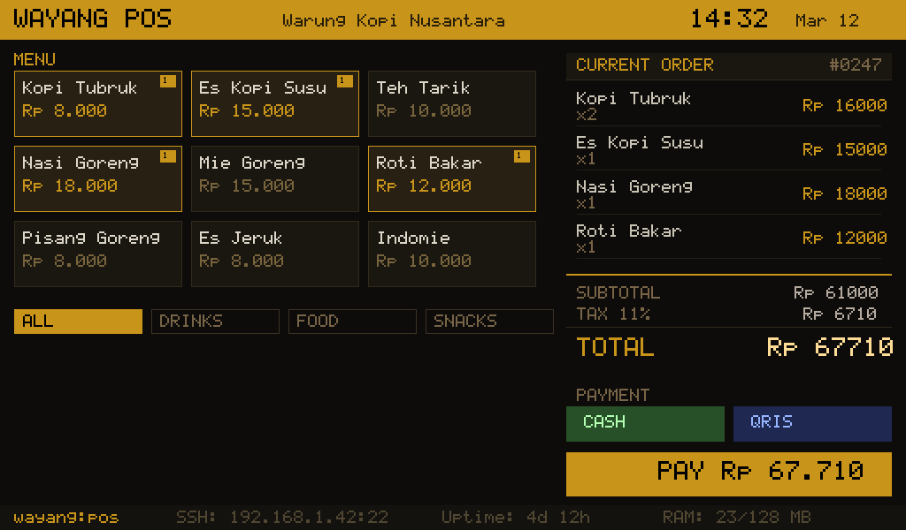

# ꦮꦪꦁ Wayang POS

Lightweight Point of Sale kiosk app for [WayangOS](https://wayangos.pages.dev). `fbpos-v3.c` is a single-file C application that renders straight to the Linux framebuffer — no X11, no Wayland, no SDL, no desktop environment.



## How it works

- **Direct framebuffer rendering** to `/dev/fb0` via `<linux/fb.h>` (double buffered, amber/gold theme).
- **Embedded 8x16 bitmap font** (`font8x16.h`) — no font libraries required.
- **Linux evdev input** (`<linux/input.h>`): keyboard, mouse, and touchscreen (`EV_KEY`, `EV_REL`, `EV_ABS` / multitouch), read from `/dev/input/event*`. A virtual on-screen keyboard and nav buttons provide full touch operation.
- **Virtual terminal handoff** via `<linux/kd.h>` (`KDSETMODE` to graphics mode) so the console does not paint over the UI.
- **Optional SQLite persistence**: when compiled with `-DSQLITE_INTEGRATION`, data is stored in `/data/pos.db` (WAL mode). Without it the app runs with an in-memory menu and no order history.

## Features

- Login screen with **admin / cashier roles** (PIN/password). Default accounts: `admin` / `admin123` and `kasir` / `kasir123`.
- Menu management (**CRUD**) — add, edit, and (de)activate items, admin-only user management.
- **Categories** (e.g. Drinks / Food / Snacks) with filter tabs.
- Order building with quantity tracking and configurable tax.
- Payment methods: Cash + QRIS.
- **Order history** with pagination.
- Menu grid **pagination** (`<` / `>` nav, PgUp/PgDn, Left/Right).
- Touchscreen support with virtual keyboard for text entry.

## Requirements

- **Linux only** — the source includes `<linux/fb.h>` and `<linux/input.h>` and will **not** compile on macOS or Windows.
- A framebuffer device (`/dev/fb0`) and input devices (`/dev/input/event*`).
- Target hardware: **Orange Pi Zero 2W** (aarch64) or **x86_64**, **1024x600** display.
- Optional: SQLite amalgamation (`sqlite3.c` + `sqlite3.h`) for persistence.

## Build

Without SQLite:

```bash
cd wayangos-pos
make                     # gcc -static -O2 -o wayang-pos fbpos-v3.c -lm
```

With SQLite (place `sqlite3.c` / `sqlite3.h` in the repo root or in `$HOME/wayangos-build`):

```bash
cd wayangos-pos
make                     # auto-detects sqlite3.c and links -DSQLITE_INTEGRATION -lpthread
```

Or from the repo root using the build script, which emits `$HOME/wayangos-build/wayang-pos-static`:

```bash
BUILD_DIR=$HOME/wayangos-build ./scripts/build-pos.sh
```

Manual compile:

```bash
# without SQLite
gcc -static -O2 -o wayang-pos fbpos-v3.c -lm

# with SQLite
gcc -static -O2 -o wayang-pos fbpos-v3.c sqlite3.c -lm -lpthread -DSQLITE_INTEGRATION
```

## Deploy

```bash
scp wayang-pos root@wayang:/usr/bin/
ssh root@wayang '/usr/bin/wayang-pos'
```

`scripts/build-pos-iso.sh` installs the binary into the initramfs at `/usr/bin/wayang-pos` and auto-starts it from `/etc/init.d/pos-app`.

## License

MIT — see [LICENSE](LICENSE).
